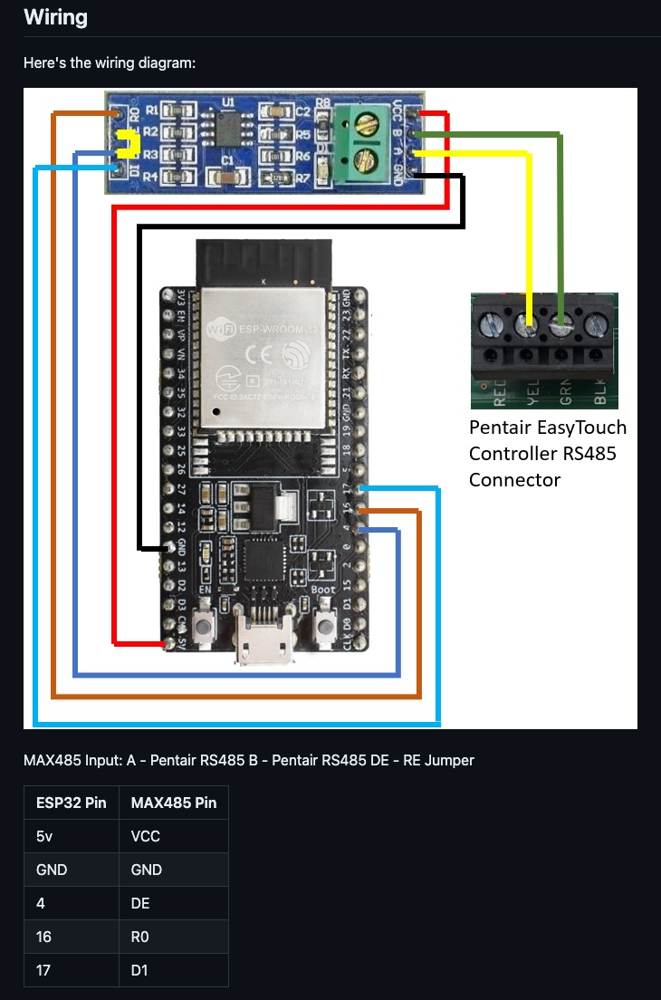

# home-automation

## Home Assistant

### Determining database sizes

```
SELECT table_schema as `Database`,table_name AS `Table`,round(((data_length + index_length) / 1024 / 1024), 2) `Size in MB` FROM information_schema.TABLES ORDER BY (data_length + index_length) DESC LIMIT 5;
```

## Shelly

### Offline Firmware Update

1. Download the firmware you need from the [Shelly Forum Firmware Topic](https://www.shelly-support.eu/index.php?shelly-firmware-archive/).
2. Add it to repository [npawelek/firmware](https://github.com/npawelek/firmware).
3. The [nginx deployment](https://github.com/npawelek/k8s-gitops/tree/master/cluster/apps/nginx) will automatically sync the firmware repository every `60s`.
4. Use the Shelly OTA URL which points to the locally served file.
    ```
    # Set some variables to make this easier (USER and PASS are only required if authentication is enabled)
    ADDR=192.168.10.
      USER=
      PASS=

    # Shelly Flood (SHWT-1) Example
    http --auth $USER:$PASS http://$ADDR/ota?url=http://int.nathanpawelek.com/shelly/SHWT-1/v1.11.8.zip

    # Shelly Motion (SHMOS-01) Example
    http --auth $USER:$PASS http://$ADDR/ota?url=http://int.nathanpawelek.com/shelly/SHMOS-01/v2.0.5.zip

    # Shelly Door/Window 2 (SHDW-2) Example
    http --auth $USER:$PASS http://$ADDR/ota?url=http://int.nathanpawelek.com/shelly/SHDW-2/v1.11.8.zip
    ```

## Valetudo

### Valetudo Firmware Update

Valetudo instructions can be found [here](https://valetudo.cloud/pages/general/upgrading.html).

```
ssh root@192.168.10.145
killall valetudo
wget http://int.nathanpawelek.com/valetudo/2022.10.0/valetudo-aarch64 -O /data/valetudo

reboot
```

### Maploader binary

```
ssh root@192.168.10.145
wget http://int.nathanpawelek.com/maploader/v1.8.1/maploader-arm64 -O /data/maploader-binary
chmod +x /data/maploader-binary

# Verify it is loaded at boot (second line in the if block)
vi /data/_root_postboot.sh
if [[ -f /data/valetudo ]]; then
        VALETUDO_CONFIG_PATH=/data/valetudo_config.json /data/valetudo > /dev/null 2>&1 &
        VALETUDO_CONFIG_PATH=/data/valetudo_config.json /data/maploader-binary > /dev/null 2>&1 &
fi

reboot
```

## Pentair ESP32 Controller

###

Steps to utilize an ESP32 and MAX485 to interface with the existing COM port on the EasyTouch controller. Here are the steps used to build it.

### Install Steps

1. Install esp-idf (release/v4.4). esp-idf must be >= v4.2 and <= v5.x
2. Pull down esp32-pentair-controller
3. Update MQTT settings
4. Wire up ESP32 and MAX485



5. Compile and flash ESP32
6. Connect to esp32 SSID with default password (esp32pwd)
7. Configure wifi settings based on your network
8. Shut off power to the controller and wire up (use ethernet to controller)

### Log

```
cd github
git clone -b release/v4.4 --recursive https://github.com/espressif/esp-idf.git
cd esp-idf
./install.sh esp32
alias get_idf='. $HOME/github/esp-idf/export.sh'
get_idf
cd ..
git clone https://github.com/michaelusner/esp32-pentair-controller.git
cd esp32-pentair-controller
# Update MQTT settings in main.c
idf.py set-target esp32
idf.py menuconfig
idf.py -p /dev/cu.usbserial-0001 build flash monitor
# Must place the device in download mode (When the device goes to flash, press EN and other button simultaneously; after a few seconds, release the EN button. Let go when flashing begins)
# Use ctrl+] to escape the serial log
```