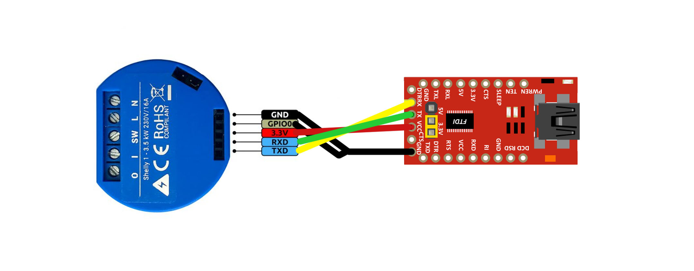
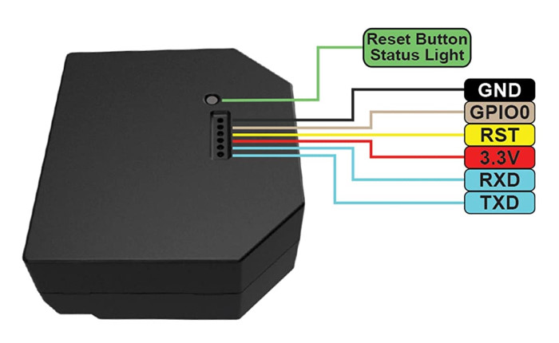

# ESPHome devices

# Shelly 1

# Shelly 1PM

In the current implmentation of Shelly 1PM, it wasn't feasible to bridge the GPIO pins to obtain these readings ([Amp/Voltage Thread](https://github.com/arendst/Tasmota/issues/5716)). Shelly mentioned they planned to get in the future, but that has yet to happen.

# Shelly 2.5

