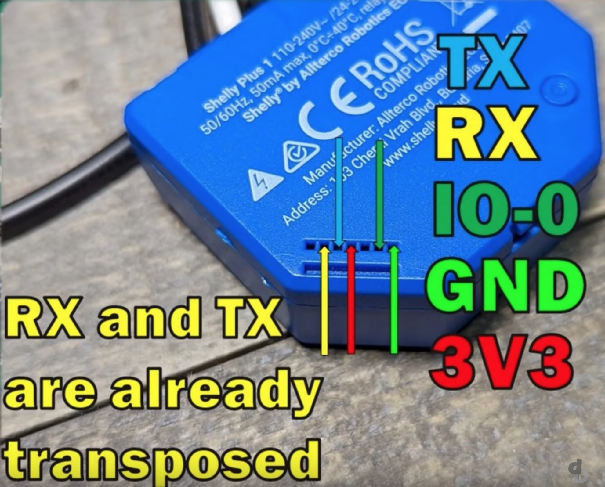

# ESPHome-related devices

## Shelly

### Shelly Plus 1

### Shelly 1

### Shelly 1PM

In the current implmentation of Shelly 1PM, it wasn't feasible to bridge the GPIO pins to obtain these readings ([Amp/Voltage Thread](https://github.com/arendst/Tasmota/issues/5716)). Shelly mentioned they planned to get in the future, but that has yet to happen.

### Shelly 2.5

## Sensors

### Xiaomi LYWSD03MMC (Temp and Humidity)

Flashed with the custom [pvvx firmware](https://github.com/pvvx/ATC_MiThermometer).

[Firmware flashing page](https://pvvx.github.io/ATC_MiThermometer/TelinkMiFlasher.html)

Settings configured as follows:
- Temperature: `F`
- Comfort
- Show battery
- Advertising type: `Custom` (default intervals)
- RF TX Power: `VANT +3.01 dbm`
- Minimum LCD refresh rate: `12.75`s (longest configurable)
- Comfort parameters:
  - Temp low: `20.00`
  - Temp high: `22.77`

### Xiaomi HHCCJCY01 (MiFlora, Huahuacaocao)

Use the [Flower Care app](https://apps.apple.com/us/app/flower-care/id1095274672) to update the firmware. It's confirmed that battery levels are not reported as of firmware version 3.2.1. Use the standard [ATC tool](https://atc1441.github.io/TelinkFlasher.html) to pair with the device, then use bluetooth settings under MacOS to determine the underlying BLE address.

Link to previously purchased devices that seem to work: [AliExpress (Smart Version)](https://www.aliexpress.com/item/4001264603672.html). I received a green one which seems to indicate a CN version, and it seems to work fine in ESPHome.
